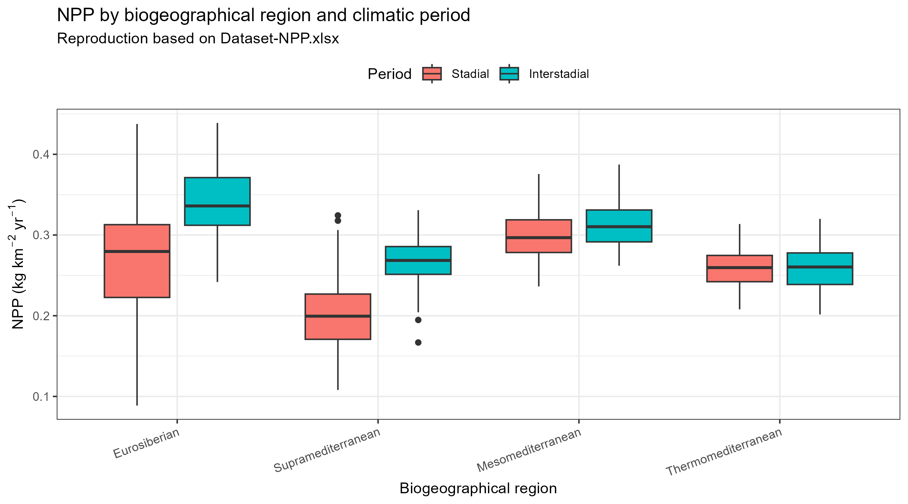
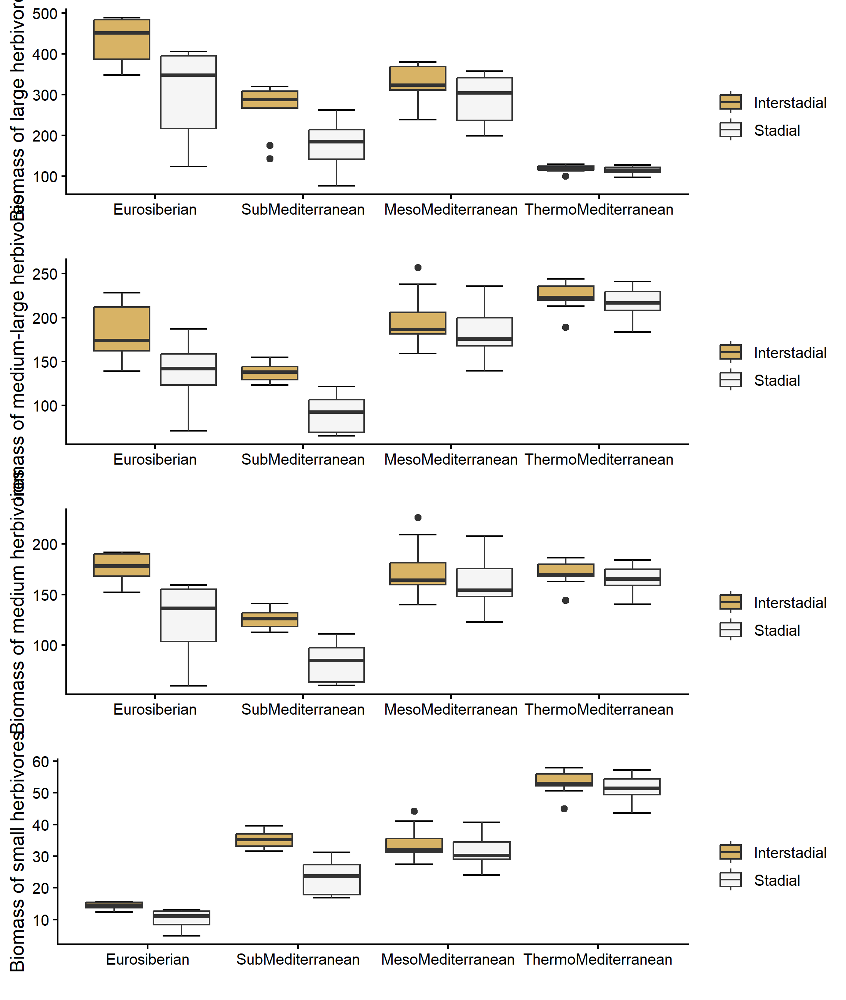
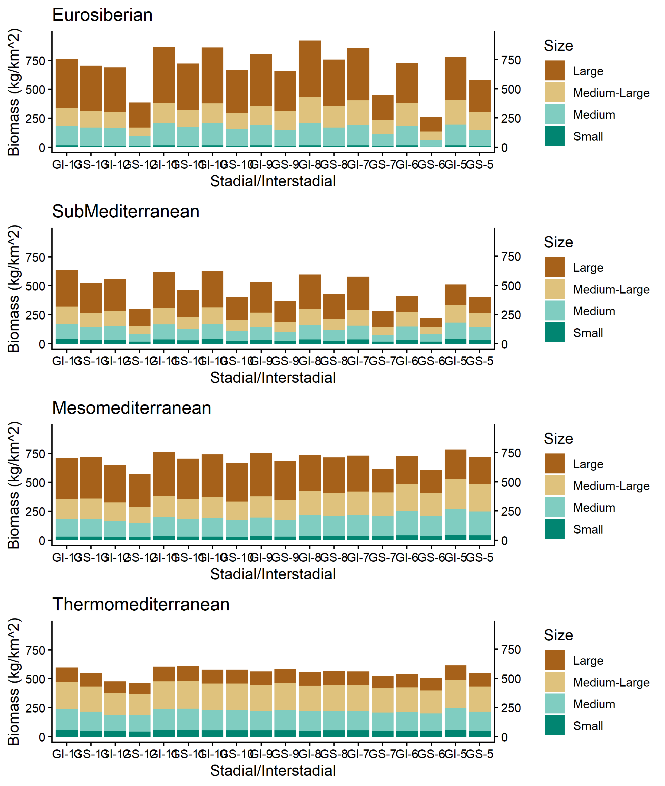

# 复现结果

## Table 1：MIS 3晚期冷暖期各生物地理区NPP数据

下表复现了论文Table 1，比较四个生物地理区在Stadial/Interstadial阶段的NPP差异。

```{r}
#| label: table1
#| eval: false
#| echo: true
#| code-summary: "Table 1 复现代码"

library(readxl)
library(tidyverse)

npp_file <- "data/raw/Dataset-NPP.xlsx"
npp_raw <- read_excel(npp_file, sheet = "NPP_Regions")

npp_long <- npp_raw %>%
  filter(!is.na(Phase)) %>%
  select(Age, Phase, starts_with("NPP_")) %>%
  pivot_longer(cols = starts_with("NPP_"), names_to = "Region", values_to = "NPP") %>%
  mutate(
    Region = str_remove(Region, "^NPP_"),
    Region = recode(Region, "Submediterranean" = "Supramediterranean"),
    Period = case_when(
      str_detect(Phase, "^GS") ~ "Stadial",
      str_detect(Phase, "^GI") ~ "Interstadial",
      TRUE ~ NA_character_
    ),
    Region = factor(Region, levels = c("Eurosiberian", "Supramediterranean",
                                        "Mesomediterranean", "Thermomediterranean")),
    Period = factor(Period, levels = c("Stadial", "Interstadial"))
  ) %>%
  filter(!is.na(Period), !is.na(NPP))

# 变异系数函数
cv <- function(x) 100 * sd(x, na.rm = TRUE) / mean(x, na.rm = TRUE)

# 统计汇总
table1_summary <- npp_long %>%
  group_by(Region, Period) %>%
  summarise(
    Mean = mean(NPP, na.rm = TRUE),
    sd = sd(NPP, na.rm = TRUE),
    CV = cv(NPP),
    .groups = "drop"
  )

# Wilcoxon检验
wilcox_results <- npp_long %>%
  group_by(Region) %>%
  summarise(
    W = wilcox.test(NPP[Period == "Interstadial"], NPP[Period == "Stadial"])$statistic,
    P = wilcox.test(NPP[Period == "Interstadial"], NPP[Period == "Stadial"])$p.value,
    .groups = "drop"
  )
```

### Table 1 复现结果

{fig-cap="各生物地理区NPP箱线图"}

## Figure 3：食草动物承载力箱线图

Figure 3展示了四大区域不同体型食草动物在冰期/间冰期的承载力差异。

```{r}
#| label: fig3-code
#| eval: false
#| echo: true
#| code-summary: "Figure 3 复现代码"

# 详见 scripts/03_fig3_author_code.R
# 主要步骤：
# 1. 读取NPP数据和食草动物物种数据
# 2. 建立NPP-食草动物生物量回归模型
# 3. 估算各体型食草动物在每个气候阶段的承载力
# 4. 绘制箱线图
```

### Figure 3 复现结果

{fig-cap="四大区域不同体型食草动物承载力箱线图"}

**关键发现：**

- **大型食草动物**：欧洲西伯利亚区始终最高，热地中海区最低
- **小型食草动物**：格局完全相反，热地中海区最高
- **中型/中-大型（尼人核心猎物）**：
  - 间冰期：北部略高
  - 冰期：北部骤降≈1/3，南部仅降3%–8%，南部反超北部

## Figure 5：食草动物承载力堆积柱状图

Figure 5将食草动物承载力与文化序列进行时空耦合分析。

```{r}
#| label: fig5-code
#| eval: false
#| echo: true
#| code-summary: "Figure 5 复现代码"

# 详见 scripts/04_fig5_author_code.R
# 主要步骤：
# 1. 使用与Fig3相同的NPP-生物量模型
# 2. 计算每个气候阶段各体型食草动物的生物量
# 3. 按区域绘制堆积柱状图
```

### Figure 5 复现结果

{fig-cap="四大区域食草动物承载力时序变化"}

**关键耦合：**

1. **欧洲西伯利亚区**：GS‑12冰期NPP↓33.3%、食草动物↓45%，莫斯特同步消失；GI‑11生产力回升，奥瑞纳出现
2. **上地中海区**：GS‑11/10生产力连续暴跌，莫斯特消失，无现代人长期占据
3. **中/热地中海区**：生产力波动极小，莫斯特最晚消失（热地中海区≈3.5–3.3万年前），与奥瑞纳重叠最久
